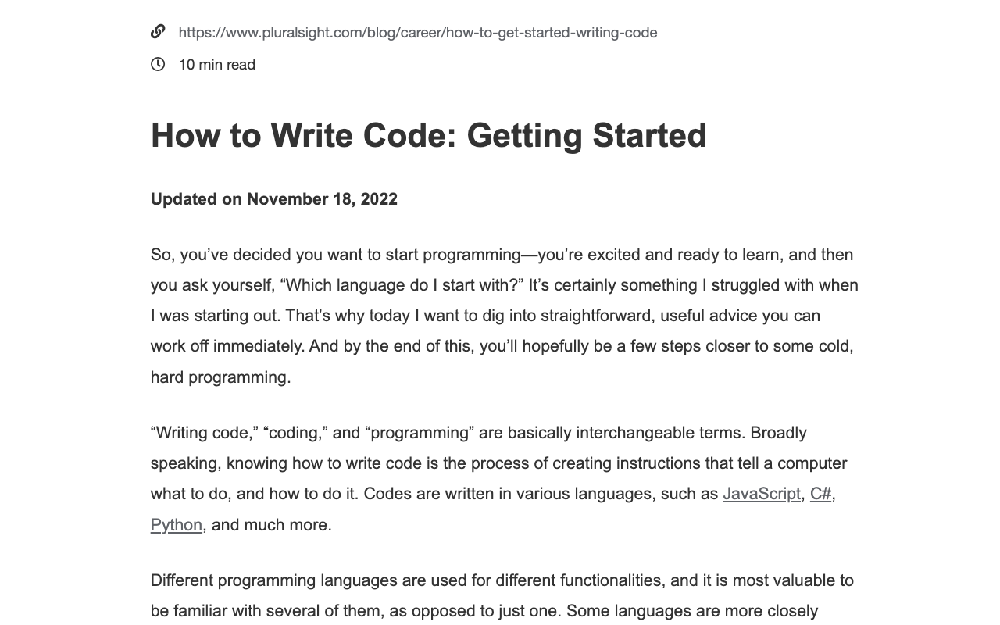
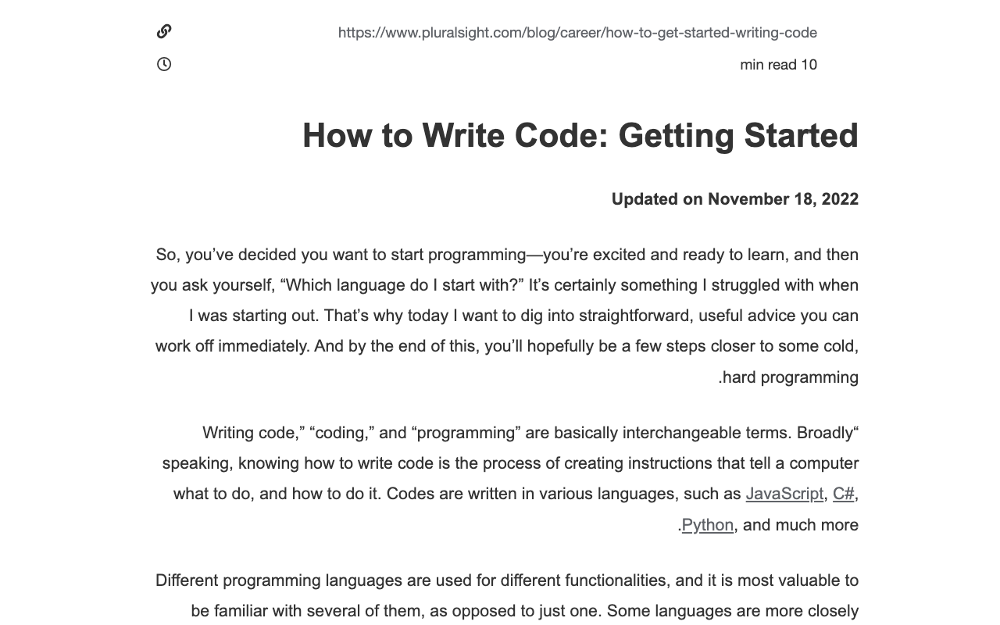

# LTR-RTL Chrome Extension

This Chrome extension allows users to quickly change the text direction of a webpage between Left-To-Right (LTR) and Right-To-Left (RTL) using context menus. It provides a convenient way for users to switch directions based on their needs.

## Screenshots

    
    

## Features

- **Context Menu Integration**: Access the text direction options directly from the context menu.
- **Dynamic Menu Updates**: The current direction is indicated with a checkmark in the context menu.
- **Simple Direction Change**: Easily change the text direction of any webpage.

## Installation

You can download this extension from the Google Chrome Store:

[Download from Chrome Web Store](https://chromewebstore.google.com/detail/ltr-rtl/diedjfeojbodkmhiekmafpecgkllbhcf?authuser=0&hl=en)

Alternatively, to install it manually, follow these steps:

1. Clone or download this repository to your local machine.
2. Open Chrome and go to `chrome://extensions/`.
3. Enable "Developer mode" by toggling the switch in the top right corner.
4. Click on "Load unpacked" and select the directory where you saved the extension files.

## Usage

1. Right-click anywhere on a webpage.
2. Select either **LTR** (Left-To-Right) or **RTL** (Right-To-Left) from the context menu.
3. The text direction of the webpage will change according to your selection.

## Code Overview

### Key Functions

- `setupContextMenus(currentDirection)`: Sets up the context menu options for LTR and RTL. The current direction is marked with a checkmark.
- `setPageDirection(direction)`: Changes the `dir` attribute of the document's root element (`<html>`) to either `ltr` or `rtl`, affecting the text direction of the page.

### Event Listeners

- `chrome.runtime.onInstalled`: Initializes the context menus when the extension is installed.
- `chrome.runtime.onMessage`: Listens for messages from other parts of the extension to update context menus dynamically.
- `chrome.contextMenus.onClicked`: Executes the direction change when a context menu item is clicked.

## License

This project is licensed under the MIT License. See the [LICENSE](LICENSE) file for more information.

## Contributing

Contributions are welcome! If you have suggestions or improvements, feel free to create an issue or submit a pull request.

## Contact

For any inquiries or issues, please reach out via email at [alirezatahriri4@gmail.com].
